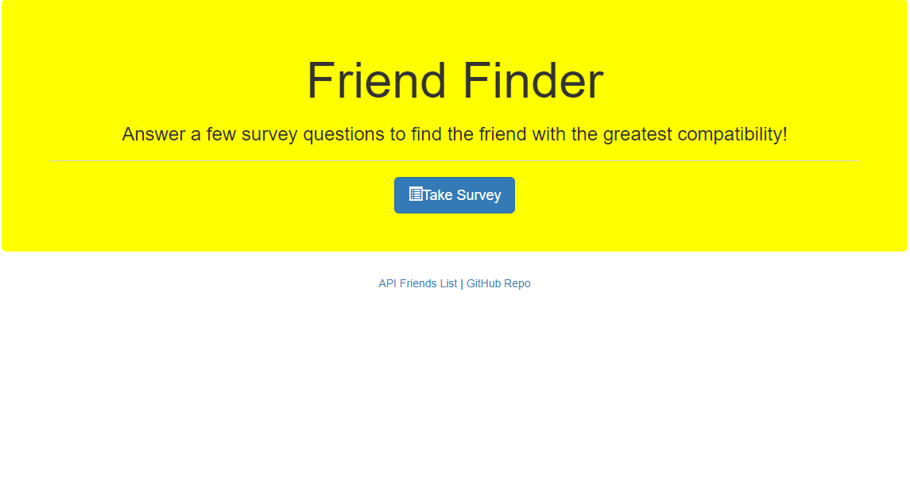
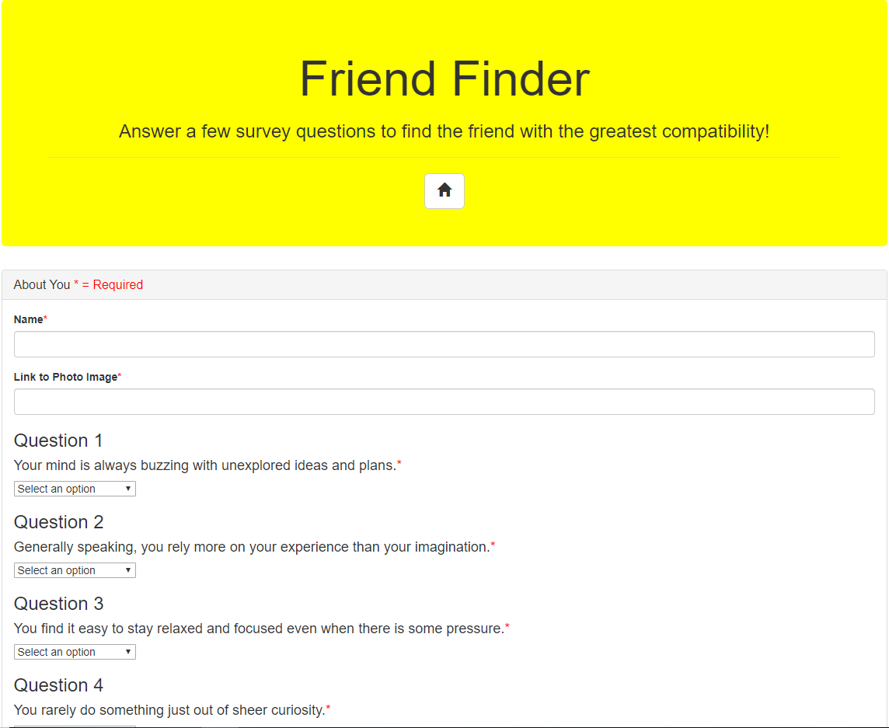

# Friend Finder

Friend Finder is a compatibility based application. The user will take a survey and then their answers will be compared with those from other users. They will then be presented with a best match showing that friends name and photo. 

## NPM Dependencies
* Express
* Body Parser
* Path

## How it works

Browse to https://intense-stream-24473.herokuapp.com/

Click the "Take Survey" button

Add your name and a link to your photo and fill out the survey and click submit

